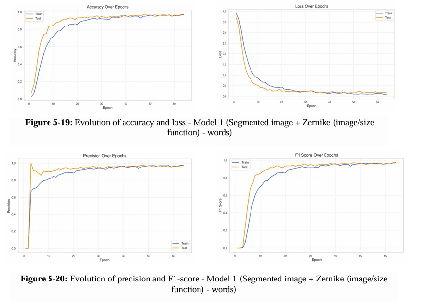

# 🤟 Arabic Sign Language Recognition System

This project delivers a complete Arabic Sign Language (ArSL) recognition system, consisting of two key components:

- 🧠 **Deep Learning Recognition Model**  
  A state-of-the-art sign recognition system trained using a novel fusion of handcrafted geometric descriptors (e.g., Zernike moments from size functions) and deep CNN features (EfficientNet). The model leverages **BiLSTMs** and **Transformer encoders** to capture both temporal dynamics and spatial structure across video sequences. This hybrid approach improves robustness under challenging conditions such as low video quality, background noise, and signer variability.

- 📱 **Flutter Mobile Application**  
  A modern, educational mobile app built with Flutter. It allows users to **learn**, **explore**, and **translate** Arabic signs interactively. Features include video browsing by category or signer, gesture playback, a translation interface powered by the trained model, and user-friendly tools like favorites and search.

Together, these components form a powerful and accessible platform for learning and recognizing Arabic Sign Language using cutting-edge machine learning techniques.

---

## 🧠 Core Contributions

- 📊 A **comparative study** of various architectures (CNN, BiLSTM, Transformer).
- 🧼 Novel **image preprocessing** using:
  - **size functions** (6 measurement functions)
  - **Zernike moments** on size function 2d representation
  - **EfficientNetB0** features on segmmented hand images
- 🔀 A **dual-stream model**:
  - Stream 1: BiLSTM on Zernike-moment-based shape functions.
  - Stream 2: Transformer on EfficientNet features.
  - Fusion via an **attention-based layer** for final prediction.

---

## 📁 Dataset

We used a custom Arabic Sign Language dataset of isolated and continuous sign videos.  
📦 **[Link to Dataset]https://hamzah-luqman.github.io/KArSL**

---

## 🧠 Models Comparison

In this project, we designed and compared several models to evaluate the contribution of **Size Functions** to sign language recognition. All models share a common **Transformer encoder**, and differ mainly in how they represent hand gestures and incorporate morphological descriptors.

---

### 📍 Model 1 – Landmark-Based Model

**Input:** Hand landmarks (MediaPipe – 21 keypoints per hand)  
**Architecture:**  
- Landmark sequences → Transformer encoder → Classifier

**Description:**  
This model uses only the (x, y) coordinates of hand keypoints extracted using MediaPipe. By focusing purely on geometry, it is highly lightweight and robust to noise, lighting, and background variations.

**Pros:**
- Very fast and efficient
- Robust to appearance-based noise
- Ideal for embedded systems

---

### 🖼️ Model 2 – Segmented Image Model

**Input:** Binary segmented images of both hands  
**Architecture:**  
- Image → EfficientNet-B0 → Feature vectors → Transformer → Classifier

**Description:**  
This model processes segmented binary images of hands to extract visual features using EfficientNet. It captures the overall appearance and silhouette of gestures, such as hand posture and relative positions.

**Pros:**
- Simple and effective baseline
- Leverages CNN power for spatial patterns
- Less sensitive to color and lighting

---

### 🧩 Model 3 – Segmented Image + Tchebichef Moments

**Input:** Binary segmented images of hands  
**Architecture:**  
- EfficientNet features + Tchebichef moments → Concatenation → Transformer → Classifier

**Description:**  
In this configuration, we combine visual descriptors (EfficientNet) with explicit shape descriptors (Tchebichef moments) extracted from the same binary images. This enriched feature vector enhances discrimination between similar-looking gestures.

**Pros:**
- Stronger shape representation
- Improves over visual-only models
- Still computationally manageable

---

### 🌀 Model 4 – Segmented Image + Zernike Moments (Size Function Diagrams)

**Input:**  
- Binary hand images → EfficientNet  
- Size function diagram images → Zernike moments (order 8)

**Architecture:**  
- Flow 1: EfficientNet → Transformer  
- Flow 2: Zernike → BiLSTM  
- Combined via Cross-Attention → Classifier

**Description:**  
This dual-stream model merges visual features with shape descriptors (Zernike moments) extracted from size function diagram images. The two streams are fused using a cross-attention mechanism that allows dynamic visual features to query structural information.

**Pros:**
- Best performing architecture
- Fuses appearance and shape intelligently
- Robust to noise and gesture variability

---

### 📈 Model 5 – Segmented Image + Point Descriptors (Hu or Tchebichef Moments)

**Input:**  
- Binary hand images → EfficientNet  
- Size function points → Hu or Tchebichef moments

**Architecture:**  
- EfficientNet features + Hu/Tchebichef moments → Concatenation → Transformer → Classifier

**Description:**  
Here, shape moments are calculated directly from point-based size functions, bypassing image diagrams. It’s a single-stream model with concatenated visual and shape features at each frame, making it lighter than dual-stream architectures.

**Pros:**
- Computationally efficient
- Strong shape modeling
- Good performance for real-time use

---

### 🧪 Summary Table

| **Model** | **Input Type** | **Descriptor Type** | **Fusion** | **Notes** |
|-----------|----------------|---------------------|------------|------------|
| Landmark-Based | Landmarks (x, y) | Spatial keypoints | None | Fastest, robust, minimal features |
| Segmented Image | Hand masks | EfficientNet visual features | None | Strong baseline for visual learning |
| Image + Tchebichef | Hand masks | EfficientNet + Tchebichef | Concatenation | Improved shape encoding |
| Image + Zernike | Hand masks + Size Function Diagrams | EfficientNet + Zernike | Dual-stream w/ Cross-Attention | Best performance |
| Image + Points | Hand masks + Size Function Points | EfficientNet + Hu/Tchebichef | Concatenation | Lightweight, efficient, good shape fidelity |

###Comparison table of the different models accuracies :

---

## 🏆 Best Performing Model Architecture

Our best-performing model combined geometric descriptors and CNN-based visual features in a dual-stream setup. Each frame was segmented into left/right hands, then processed separately:

- **Zernike Stream**:
  - Input: Zernike moments of size function images.
  - Architecture: BiLSTM.

- **EfficientNet Stream**:
  - Input: RGB segmented hand images.
  - Architecture: Transformer.

- **Fusion**: Attention-based fusion of both streams for robust recognition.

📊 Here's a graph of the architecture:

---
## 📈 Best Model Accuracy Graphs

Below are the training and validation accuracy curves of the best-performing model (Zernike + EfficientNet with attentional fusion):

### 🔹 ACCURACY, F1 SCORE, PRECISION, LOSS over epochs

---

## 📱 Flutter App (ArSL Learn & Translate)

An educational mobile app built with Flutter to promote Arabic sign language awareness and accessibility.

### 🔑 Features:
- 📂 Browse sign videos by **category**, **word**, or **signer**.
- 🌟 **Favorites**: Save videos for quick access.
- 📷 **Translate**: Upload a video (one word or a full sentence) and get its meaning in text.
- 🧠 Perfect for learning, practicing, and testing ArSL knowledge.

---

## 🚀 Technologies Used

| Component            | Tech Stack |
|---------------------|------------|
| Preprocessing       | OpenCV, Cython, NumPy |
| Feature Extraction  | Zernike Moments, EfficientNetB0 |
| Models              | CNNs, BiLSTMs, Transformers |
| Backend             | Flask (for model inference) |
| Mobile App          | Flutter & Dart |
| Visualization       | Matplotlib, Seaborn |
| Deployment          | Local & Mobile (Flutter) |

---

## 📜 License

MIT License. Feel free to use and modify for research or educational purposes.

---

## 🤝 Contributing

We welcome contributions and improvements! If you find bugs, want to add new features, or improve documentation, feel free to fork and submit a pull request.

