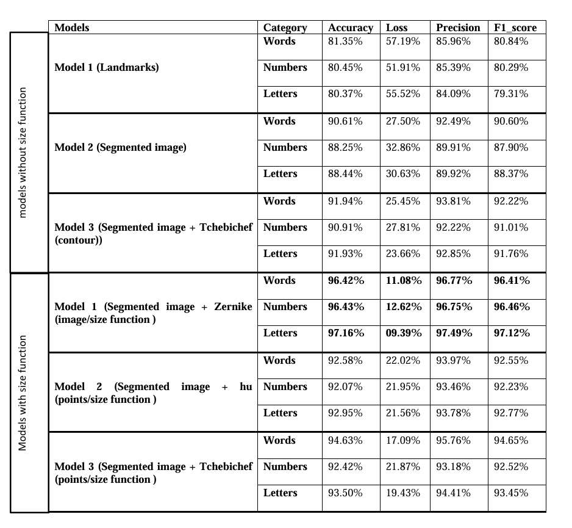
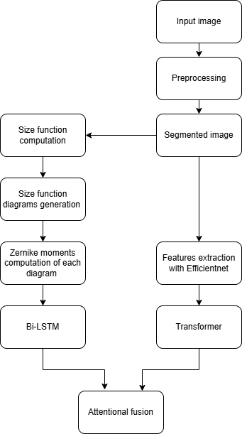

# 🤟 Arabic Sign Language Recognition System

This project presents a complete Arabic Sign Language (ArSL) recognition system with two major components:

1. **A deep learning-based sign recognition model** trained using a novel combination of geometric and CNN-based features.
2. **An educational Flutter mobile app** that allows users to explore, learn, and translate Arabic sign language.

---

## 🧠 Core Contributions

- 📊 A **comparative study** of various architectures (CNN, BiLSTM, Transformer).
- 🧼 Novel **image preprocessing** using:
  - **Shape functions** (6 measurement functions)
  - **Zernike moments** on binary segmented hands
  - **EfficientNetB0** features on RGB hand images
- 🔀 A **dual-stream model**:
  - Stream 1: BiLSTM on Zernike-moment-based shape functions.
  - Stream 2: Transformer on EfficientNet features.
  - Fusion via an **attention-based layer** for final prediction.

---

## 📁 Dataset

We used a custom Arabic Sign Language dataset of isolated and continuous sign videos.  
📦 **[Link to Dataset]https://hamzah-luqman.github.io/KArSL**

---

## 🧪 Model Comparison

Below is the accuracy comparison of various architectures tested on our dataset:

---

## 🏆 Best Performing Model Architecture

Our best-performing model combined geometric descriptors and CNN-based visual features in a dual-stream setup. Each frame was segmented into left/right hands, then processed separately:

- **Zernike Stream**:
  - Input: Zernike moments of size function images.
  - Architecture: BiLSTM.

- **EfficientNet Stream**:
  - Input: RGB segmented hand images.
  - Architecture: Transformer.

- **Fusion**: Attention-based fusion of both streams for robust recognition.

📊 Here's a graph of the architecture:

---

## 📱 Flutter App (ArSL Learn & Translate)

An educational mobile app built with Flutter to promote Arabic sign language awareness and accessibility.

### 🔑 Features:
- 📂 Browse sign videos by **category**, **word**, or **signer**.
- 🌟 **Favorites**: Save videos for quick access.
- 📷 **Translate**: Upload a video (one word or a full sentence) and get its meaning in text.
- 🧠 Perfect for learning, practicing, and testing ArSL knowledge.

---

## 🚀 Technologies Used

| Component            | Tech Stack |
|---------------------|------------|
| Preprocessing       | OpenCV, Cython, NumPy |
| Feature Extraction  | Zernike Moments, EfficientNetB0 |
| Models              | CNNs, BiLSTMs, Transformers |
| Backend             | Flask (for model inference) |
| Mobile App          | Flutter & Dart |
| Visualization       | Matplotlib, Seaborn |
| Deployment          | Local & Mobile (Flutter) |

---

## 📜 License

MIT License. Feel free to use and modify for research or educational purposes.

---

## 🤝 Contributing

We welcome contributions and improvements! If you find bugs, want to add new features, or improve documentation, feel free to fork and submit a pull request.

---

## 📬 Contact

For questions or collaborations, reach out via [your email/contact info here].

